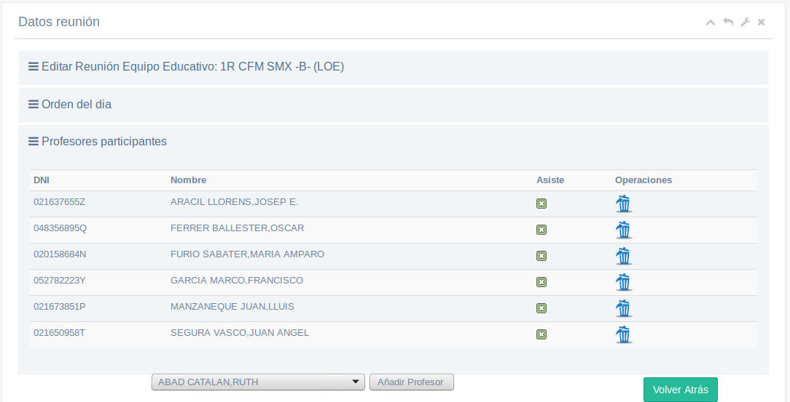
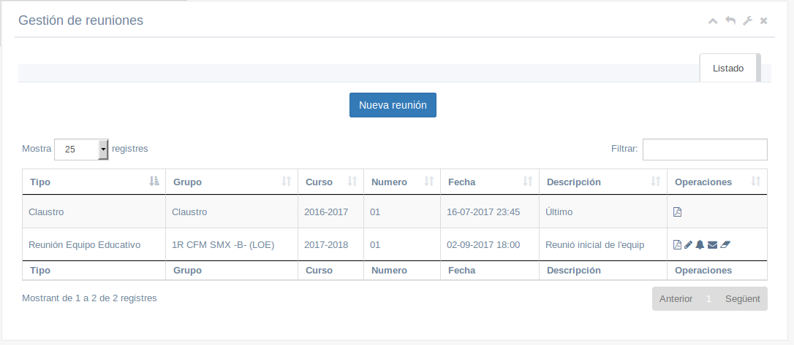
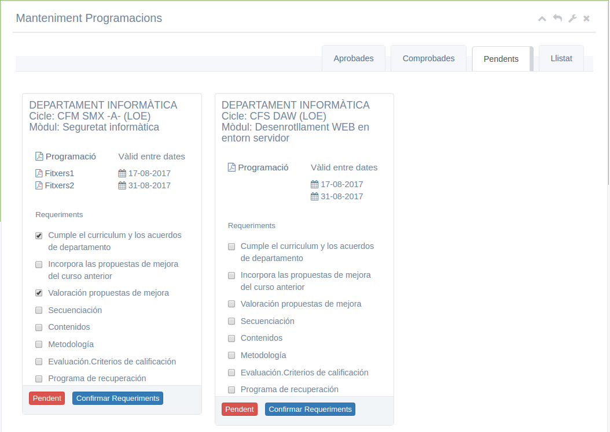

# Manual del Cap de Departement
Índex de continguts
* [Introducció](#introducció)
* [Menú 'Actes/Convocatòries' → 'Gestió de reunions'](#menú-actesconvocatòries--gestió-de-reunions)
  * [Nova reunió](#nova-reunió)
  * [Gestionar les reunions](#gestionar-les-reunions)
  * [Acta de la reunió](#acta-de-la-reunió)
* [Menú 'Cap de departament'](#menú-cap-de-departament)
  * [Autorizar programacions](#autorizar-programacions)
  * [Informe departament](#informe-departament)
---

## Introducció
Aquest manual només explica les accions que pot fer el cap d'un departament i no un professor normal. Les accions habituals de qualsevol professor estan explicades en el manual del professor.

L'accés a la intranet és igual per a tots els professors i és el sistema qui detecta quin és el seu rol (professor, tutor, cap de departament, …) i mostra les opcions adequades en cada cas.

Els tutor tenen en el menú general un apartat anomenat 'Cap de departament' però també té noves opcions en alguns altres menús.

## Menú 'Actes/Convocatòries' → 'Gestió de reunions'
Aquest apartat és exactament igual que el del tutor però el cap de departament pot convocar a més reunions de departament.

### Nova reunió
Per a convocar una nova reunió premem el botó de 'Nova reunió' i omplim els camps:
* tipo: ací indiquem el tipus de reunió que anem a convocar: de departament, d'equip educatiu, d'un grup de treball, …
* grup: si és una reunió de grup de treball ací indicarem de quin grup
* numero: indiquem el nº de reunió
* data en que es celebrarà la reunió
* descripció de la reunió que veuran la resta de convocats
* objectius de la reunió (camp opcional)
* espai on es celebrarà la reunió

Una vegada guardada la reunió ja podem completar l'ordre del dia i els participants:

Per defecte ja apareix un ordre del dia de la reunió del qual podem llevar qualsevol punt i afegir punts nous.

També apareixen ja seleccionats els professors participants: tots els de l'equip educatiu.

Igualment podem afegir o eliminar professors participants.

### Gestionar les reunions
Una vegada creada la reunió ens apareix en el llistat de reunions des d'on podem fer:

* imprimir: s'imprimeix la convocatòria en PDF
* editar: tornem a la finestra d'edició per a modificar qualsevol cosa
* avisar participants: s'envia una notificació a cadascun dels professors participants que els apareixerà en la seua icona de notificacions
* enviar convocatòria/acta: s'envia la convocatòria per e-mail als participants
* esborrar: s'esborra l'acta

### Acta de la reunió
Una vegada celebrada la reunió podem omplir l'acta de la mateixa. Per a això editem la reunió i des de la part de l''Ordre del dia' polsem en cada punt el botó d'Editar i ens apareix una zona on escriure el que s'ha parlat en la reunió sobre el punt en qüestió

Després d'omplir l'acta des del llistat de reunions podem tornar a avisar als participants o enviar l'acta. En aquest cas l'avís els indicarà que ja està l'acta disponible per a que la puguen veure.

També apareix una nova icona de 'Guardar en el gestor documental' que puja l'acta al gestor documental (dins del menú Documentació) per a que la pugen veure.

## Menú 'Cap de departament'
Aquest menú només els apareix als caps de departament i inclou les accions específiques per a ells.

### Autorizar programacions
Des d'ací els caps autortzaran totes les programacions del seu departament. 

Les programacions poden estar en un d'aquests 3 estats:
* Pendent: el professor ha pujat la programació però encara està per revisar
* Comprobada: el cap de departament ja ha comprobat la programació
* Aprobada: el departament ha aprobat la programació en una reunió de departament

Hi ha una pestanya per a cada estat on trobem totes les programacions que estan en eixe estat.

El cap de departament descarrega la programació (des de l'enllaç 'Programació') i els fitxers adicionals en cas de haver i comprova si cumpleix tots els requeriments. Segons els va comprovant els marca en la casella corresponent de la programació.

Es marquen tots els items i es polsa confirmar requeriments. Si estan tots marcats pasa a comprobada i si no es torna a l'usuari per a que la complete. Quan el departament aprova les programacions cal aprobar-les amb el botó pertinent.

### Informe departament
Al final de cada avaluació es trau el informe del cap de departament amb els resultats de tots el cicles i les activitats extraescolars.
