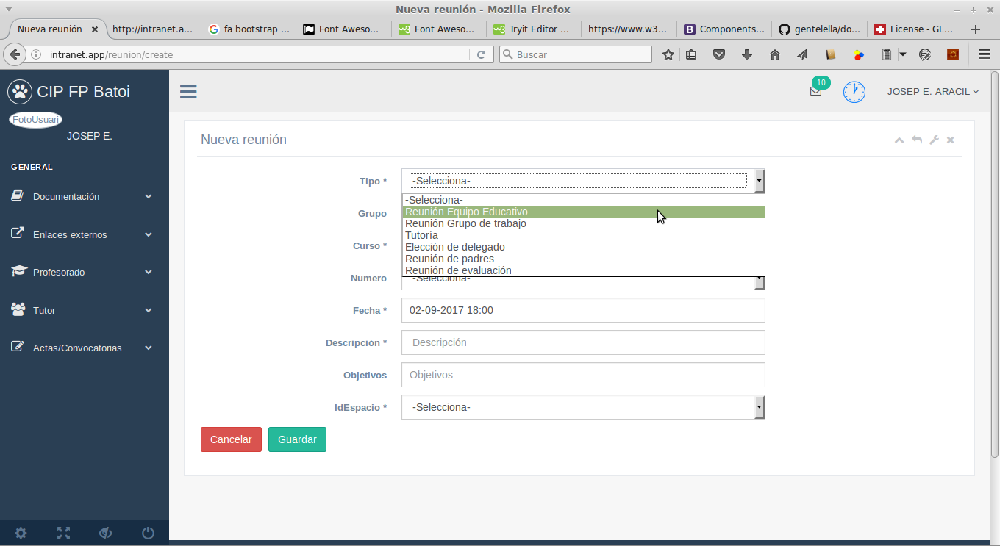
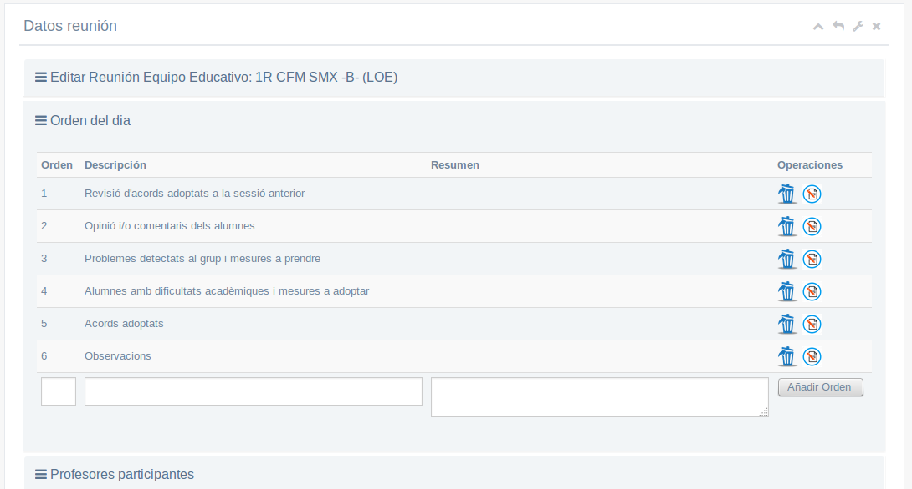
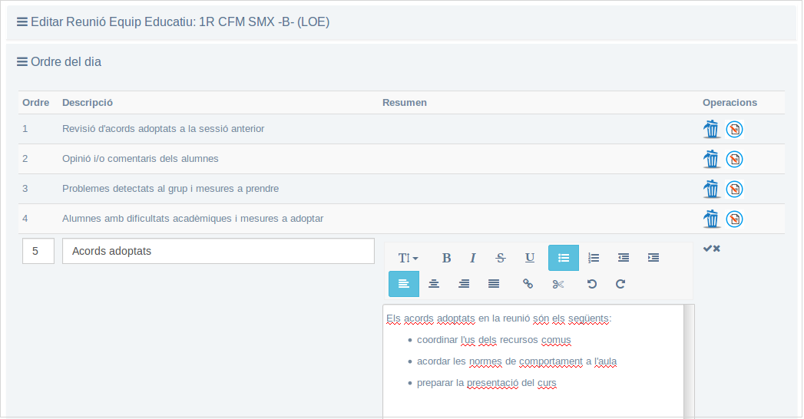
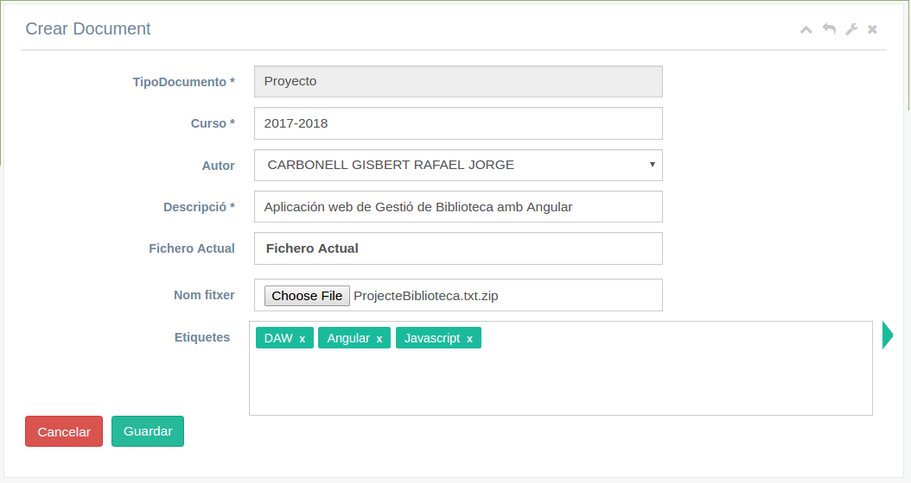
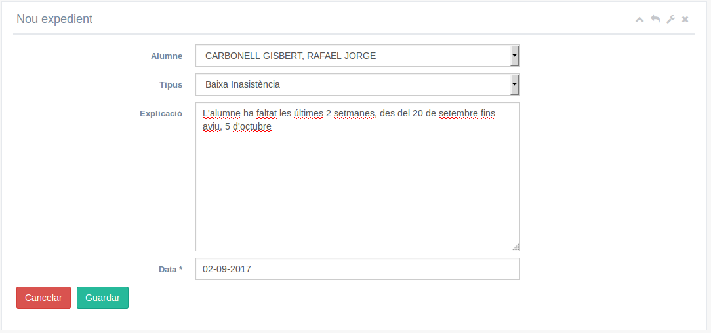
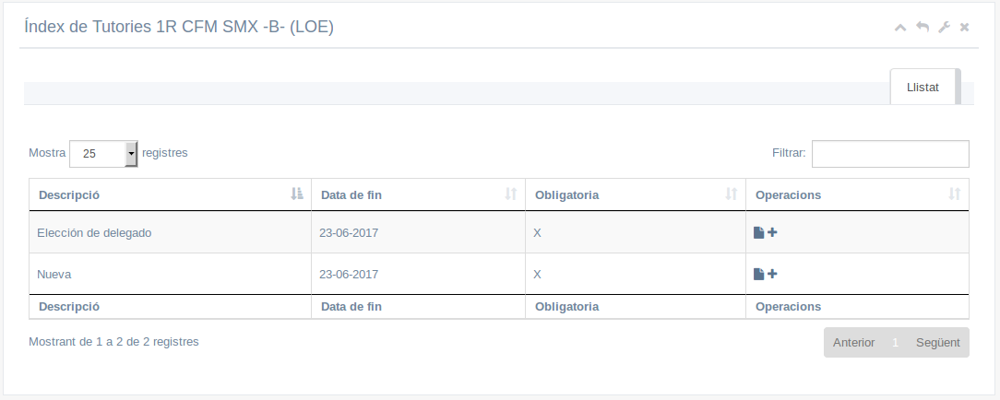
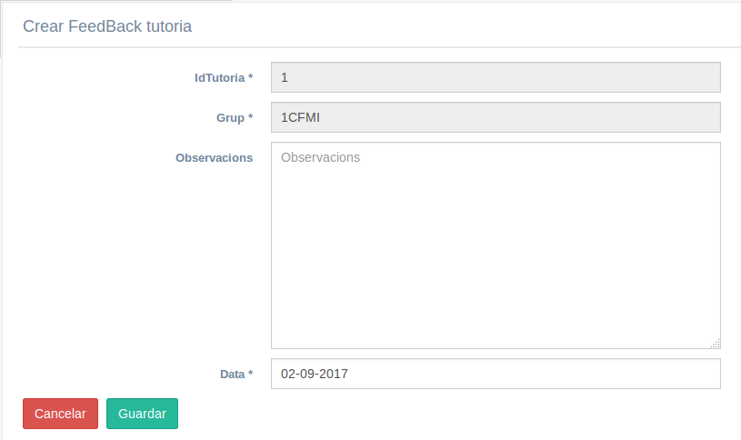
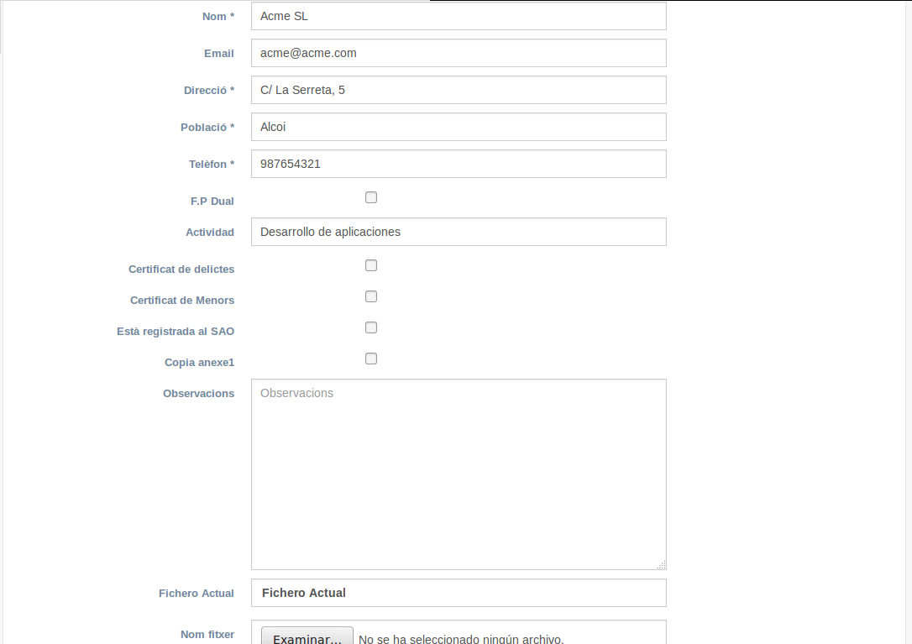
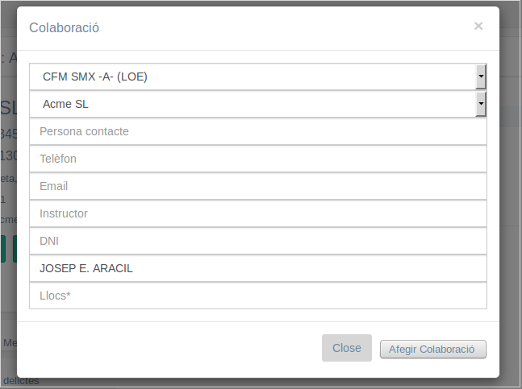
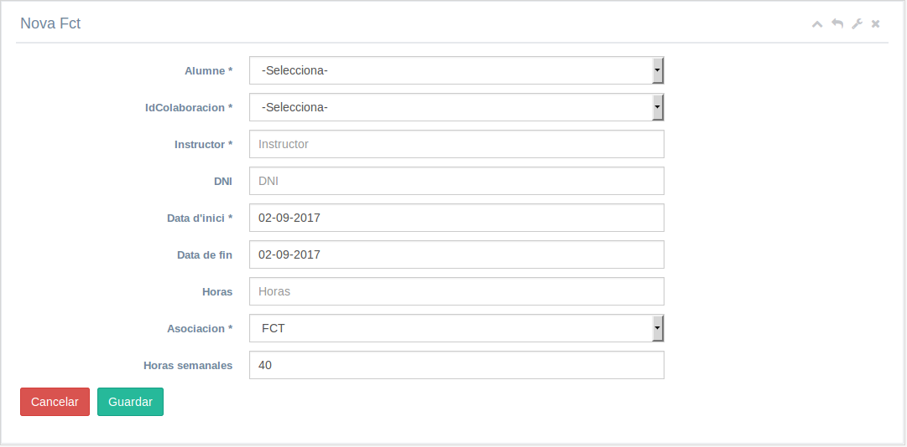

# Manual del tutor
Índex de continguts
* [Introducció](#introducció)
* [Menú 'Profesorat' → 'Gestió dels grups'](#menú-profesorat--gestió-dels-grups)
* [Menú 'Actes/Convocatòries' → 'Gestió de reunions'](#menú-actesconvocatòries--gestió-de-reunions)
  * [Nova reunió](#nova-reunió)
  * [Gestionar les reunions](#gestionar-les-reunions)
  * [Acta de la reunió](#acta-de-la-reunió)
* [Menú 'Actes/Convocatòries' → 'Gestor documental'](#menú-actesconvocatòries--gestor-documental)
* [Menú 'Tutor'](#menú-tutor)
  * [Seguiments](#seguiments)
  * [Expedients iniciats](#expedients-iniciats)
  * [Tutories](#tutories)
  * [FCT](#fct)
    * [Menú 'Empresa'](#menú-empresa)
    * [Centres de treball](#centres-de-treball)
    * [FCTs](#fcts)
---
## Introducció
Aquest manual només explica les accions que pot fer un tutor i no un professor normal. Les accions habituals de qualsevol professor estan explicades en el manual del professor.

L'accés a la intranet és igual per a tots els professors i és el sistema qui detecta quin és el seu rol (professor, tutor, cap de departament, …) i mostra les opcions adequades en cada cas.

Els tutor tenen en el menú general un apartat anomenat 'Tutor' però també té noves opcions en alguns altres menús.

## Menú 'Profesorat' → 'Gestió dels grups'
En el nostre grup apareixen 2 noves icones:
* Carnet: permet imprimir el carnet de tots els alumnes del grup. Això ha de fer-se des de caporalia que és on es troba la impresora de carnets
* Acta Fons Social Europeu (icona del €): apareix el full amb tots els alumnes que hem d'omplir i signar després d'haver explicat als alumnes la informació del FSE. Després farem una nova '_Reunió_' de tipus FSE i adjuntarem aquest full signat. L'original s'ha de lliurar a Caporalia.
* Si hi ha curs o jornada activa podem inscriure a tots els alumnes

A més, quan entrem a verure els alumnes del nostre grup apareixen 2 nous icones:
* Modificació Perfil Alumne: podem obrir el perfil d'eixe alumne per a modificar el seu e-mail la seua foto o l'idioma de la intranet per a l'alumne
* Carnet: permet imprimir el carnet de l'alumne. Ha de fer-se des de caporalia que és on es troba la impresora de carnets
* Si hi ha curs o jornada podem inscriure a l'alumne

## Menú 'Actes/Convocatòries' → 'Gestió de reunions'
El tutor tindrà que convocar diferents reunions al llarg del curs. 

### Nova reunió
Per a convocar una nova reunió premem el botó de 'Nova reunió' i omplim els camps:
* tipo: ací indiquem el tipus de reunió que anem a convocar: d'equip educatiu, d'un grup de treball, reunió de pares, reunió d'avaluació, …
* grup: si és una reunió de grup de treball ací indicarem de quin grup
* numero: indiquem el nº de reunió
* data en que es celebrarà la reunió
* descripció de la reunió que veuran la resta de convocats
* objectius de la reunió (camp opcional)
* espai on es celebrarà la reunió

Una vegada guardada la reunió ja podem completar l'ordre del dia i els participants:

Per defecte ja apareix un ordre del dia de la reunió del qual podem llevar qualsevol punt i afegir punts nous.

També apareixen ja seleccionats els professors participants: tots els de l'equip educatiu.

Igualment podem afegir o eliminar professors participants.

### Gestionar les reunions
Una vegada creada la reunió ens apareix en el llistat de reunions des d'on podem fer:

* imprimir: s'imprimeix la convocatòria en PDF
* editar: tornem a la finestra d'edició per a modificar qualsevol cosa
* avisar participants: s'envia una notificació a cadascun dels professors participants que els apareixerà en la seua icona de notificacions
* enviar convocatòria/acta: s'envia la convocatòria per e-mail als participants
* esborrar: s'esborra l'acta

### Acta de la reunió
Una vegada celebrada la reunió podem omplir l'acta de la mateixa. Per a això editem la reunió i des de la part de l''Ordre del dia' polsem en cada punt el botó d'Editar i ens apareix una zona on escriure el que s'ha parlat en la reunió sobre el punt en qüestió

Després d'omplir l'acta des del llistat de reunions podem tornar a avisar als participants o enviar l'acta. En aquest cas l'avís els indicarà que ja està l'acta disponible per a que la puguen veure.

També apareix una nova icona de 'Guardar en el gestor documental' que puja l'acta al gestor documental (dins del menú Documentació) per a que la pugen veure.

## Menú 'Actes/Convocatòries' → 'Gestor documental'
Als tutors els aparei a la part superior un botó per a 'Pujar els projectes dels alumnes'. Es tracta del mòdul de Projecte dels alumnes de cicles de grau superior.

Hem d'omplir els camps amb les dades del projecte:
* Tipus de document: ja apareix posat Projecte (no es pot canviar)
* Curs: curs en que s'ha fet el projecte
* Autor: alumne que l'ha fet
* Descripció: títol del projecte
* Fitxer: podem pujar un únic fitxer (si són més els comprimirem prèviament per a tindre només un) polsant en el botó de triar fitxer
etiquetes: podem asociar al projecte tantes etiquetes com vulgam. Per a crear cada etiqueta la escribim ací dins i polsem Intro.

## Menú 'Tutor'
Aquest menú només els apareix als tutor i inclou la majoria d'accions específiques per a ells.

### Seguiments
Apareixen els seguiments que hagen omplit tots els professors de l'equip educatiu per a que el tutor puga fer el seu informe.

### Expedients iniciats
Es vol utilitzar la intranet del Centre per a gestionar diferents expedients dels alumnes (convalidacions, baixes, ...). 

Creem un nou expedient i indiquem l'alumne, el tipus d'expedient i una explicació:

Els tipus que tenim actualment són:
* Baixa inassitència: permet donar de baixa a un alumne per faltes d'assistència segons la normativa
* Pérdua avaluació contínua: per a gestionar la predua d'avaluació contínua de l'alumne a un mòdul per faltes d'assistència. Tant ací com en el cas anterior només es poden tindre en compte les faltes marcades en Ítaca.
* Anul·lació matrícula: si un alumne vol anul·lar la matrícula
* Remisió al departament d'Orientació: envia un avís als orientadors de que han de atendre a aquest alumne. Més avant l'orientador es posarà en contacte amb el tutor per a concretar quan es farà
* Part d'amonestació: per a incoar un part d'amonestació a l'alumne

Una vegada omplit caldrà avisar a direcció de la tramitació de l'expedient amb el botó  i ja s'encarregan de resoldre'l.

### Tutories
Ací apareixen totes les tutories que ompli el departament d'orientació. 

De cada una podem:
* Veure el fitxer: podem veure la tutoria que han fet des del departament d'orientació
* Crear comentari: ací indiquem quan hem fet la tutoria i els comentaris. És important omplir això en sugeriments o millores per a que des del departament d'Orientació puguen saber cóm ha funcionat la tutoria

### FCT
Aquestes opcions només les utilitzaran els tutors de 2n curs que gestionen les pràctiques de FCT dels alumnes.
El que fem en la intranet NO substitueix al programa SAO de Conselleria que hem de continuar utilitzant. Omplir la informació en la Intranet ens permetrà obtindre automàticament els certificats per a alumnes i empreses i altres documents que el SAO no proporciona.

#### Menú 'Empresa'
El primer pas és comprobar que si la empresa ja està donada de alta en la intranet. Totes les empreses en les que hi ha concert de pràctiques estan afegides a la intranet. 

Des d'aquest menú busquem la empresa. Si la empresa ja està ens hem d'asegurar que està asociada al nostre cicle (si no afegim una nova col·laboració amb el cicle).

Si la empresa no està donada de alta la donem nosaltres des de 'Nova empresa':

Ací omplim les dades excepte el fitxer de l'Annex I (a la part inferior). Quen tinguem l'annex I signat per l'empresa l'escanejarem i el pujarem ací per a que es quede guardat.

Una vegada creada es fa automàticament la col·laboració amb el nostre cicle. 

Una vegada afegida l'empresa la intranet ens dona automàticament un número de concert per a l'empresa. Aquest número és el que utilitzem per a apuntar-la en el llibre d'empreses del departament de FCT i per al SAO.

Si posterioment l'empresa ha de acogir alumnes de qualsevol altre cicle afegirem una nova col·laboració per a eixe cicle des d'ací:

#### Centres de treball
Una col.laboració no es vincula a una empresa sinó a un centre de treball. Una empresa pot tindre varios centres de treballs. Per defecte una empresa té un centre de treball que concidix amb les dades de l'empresa. Si calen més s'han de donar d'alta de la mateixa forma que s'ha fet amb les col.laboracions.

#### FCTs
Quan ja existeix l'empresa i la col·laboració amb el nostre cicle ja podem crear la nova FCT des del menú FCTs amb el botó 'Nova FCT':

Una vegada guardada podem esborrar-la, editar-la o imprimir els certificats una vegada acabades les pràctiques.
